# I. 基于Spark的分布式矩阵乘法实现与优化

```
.
├── code/                   # 所有实验代码
├── pic/                    # 实验涉及图表
└── README.md               # 项目核心文档
```

## 1 研究目的
基于Spark实现分布式矩阵乘法，并与SystemDS中的实现进行比较。

## 2 研究内容
基于Spark实现分布式矩阵乘法，并在实现过程中尽可能引入多种优化策略，以提升计算效率。对比分析当前实现与SystemDS中若干实现的差异，探讨它们各自的优缺点和适用场景。

## 3 实验

### 3.1 实验环境

#### 硬件环境
| 集群配置      | 详细参数            |
|:----------|:----------------|
| **节点数**   | 1个主节点+3个从节点     |
| **CPU核数** | 1 core          |
| **内存大小**  | 2.0 GiB         |
| **网络带宽**  | 千兆以太网（1000Mbps） |
| **存储类型**  | SSD             |

#### 软件环境
| 软件/框架        | 详细参数               |
|:-------------|:-------------------|
| **操作系统**     | Ubuntu 22.04.5 LTS |  |
| **JDK**      | 11.0.29            |  |
| **Spark**    | 3.5.0              |  |
| **SystemDS** | 3.3.0              |  |
| **Python**   | 3.10.12            |  |


### 3.2 实验负载
本实验采用随机生成的矩阵作为数据集，通过控制矩阵规模和稀疏度两个维度，构建多组实验负载，以全面对比不同实现的性能表现。
#### 实验负载配置表
| 负载编号 | 矩阵规模（行×列） | 稠密度（density） |
|------|-----------|--------------|
| 1    | 1000×1000 | 0.01         | 
| 2    | 1000×1000 | 0.1          | 
| 3    | 1000×1000 | 1.0          | 
| 4    | 3000×3000 | 0.01         | 
| 5    | 3000×3000 | 0.1          | 
| 6    | 3000×3000 | 1.0          | 
| 7    | 5000×5000 | 0.01         | 
| 8    | 5000×5000 | 0.1          | 
| 9    | 5000×5000 | 1.0          | 
> 说明：<br>
> 稠密度定义：稠密度=（矩阵中非零元素个数÷矩阵总元素个数）。<br>
> 数据生成方法：采用基于NumPy+PySpark RDD的优化生成方案，具体实现为代码中的`generate_sparse_matrix_optimized`方法。

### 3.3 实验步骤
1.  **环境部署与验证**
    部署Spark集群、SystemDS及相关依赖，验证集群可用性。
    
    成功部署Spark：
    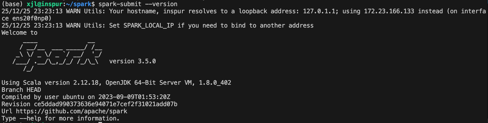
    
    集群可用性：
    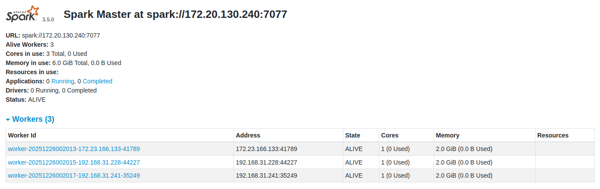
2.  **实验数据集生成**
    基于代码中`generate_sparse_matrix_optimized`方法，按照上述实验负载生成矩阵数据集，以Spark RDD分布式存储。
    该生成逻辑已集成至各方案实验代码中，运行实验代码时将自动完成矩阵生成。

3.  **基于Spark的矩阵乘法实现与优化**
    基于Spark实现分布式矩阵乘法基础版本，在此基础上引入优化策略，包括分区调整、广播变量和分区调整+广播变量集成。

4.  **SystemDS实现调用**
    调用SystemDS实现矩阵乘法，分别使用其自动选择模式和强制编译为分布式模式，便于与Spark优化实现进行对比。

5.  **实验方案汇总**
    - baseline：Spark基础版
    - broadcast：Spark广播优化版
    - block：Spark分块优化版
    - broadcast+block：Spark分块+广播优化版
    - systemDS：SystemDS-默认模式/自动选择模式
    - force_systemDS：SystemDS-强制编译为分布式模式

6.  **实验执行与指标采集**
    针对每组实验负载，分别运行以上5个方案，采集关键性能指标，并绘制图表。
    Spark作业执行记录如下：
    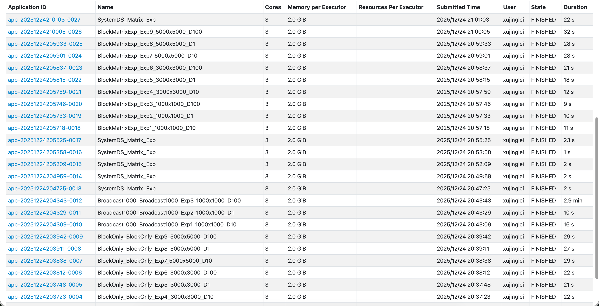

### 3.4 实验结果与分析
#### 矩阵规模和稠密度对不同指标的影响
1. 对CPU利用率的影响
<div style="display: flex; gap: 10px; margin: 16px 0;">
  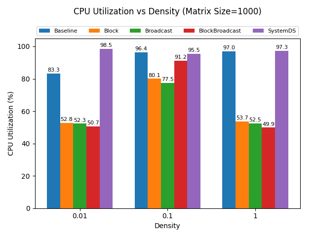
  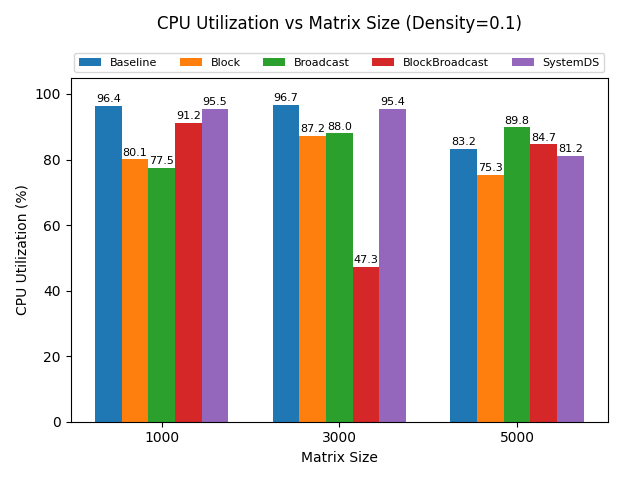
</div>

实验结果与分析：
  - 矩阵规模对CPU利用率的影响（稠密度固定为 0.1）
    - SystemDS 在矩阵规模增大时仍能保持较高的CPU利用率（约90%以上），说明其具有良好的可扩展性。
    - BlockBroadcast 与 Broadcast 在小规模时利用率较低（47.3%-77.5%），但随着规模增大逐渐提升至80%以上，说明它们在大规模计算中能更充分地利用CPU。
    - Baseline 和 Block 的利用率随规模增大有所提升，但整体仍低于SystemDS。
  - 稠密度对CPU利用率的影响（矩阵规模固定为 1000×1000）
    - SystemDS 在各密度下均表现出最高的CPU利用率（平均约95%以上），说明其调度与并行化效率极高。
    - BlockBroadcast 与 Broadcast 在低密度时CPU利用率相对较低（约50-53%），但随着密度上升逐渐提升至77%以上，说明它们在高密度下能更好地利用计算资源。
    - Baseline 和 Block 的CPU利用率居中，波动较小，说明其计算模式对密度变化不敏感，但整体利用率低于SystemDS。

小结：
 - SystemDS 在各类矩阵规模与密度下均保持最高且稳定的CPU利用率，表明其在并行调度与资源利用方面表现最优。Broadcast类策略在稀疏或小规模数据中利用率偏低，但随着数据规模与密度增加而改善。Block与Baseline实现表现中等，说明仍有优化空间。

2. 对内存利用率的影响
<div style="display: flex; gap: 10px; margin: 16px 0;">
  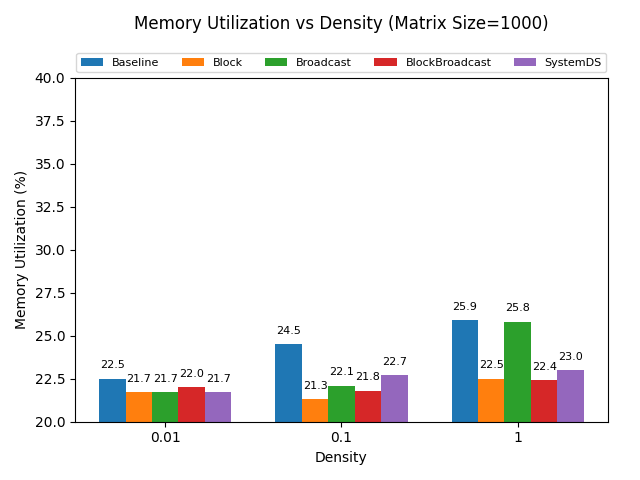
  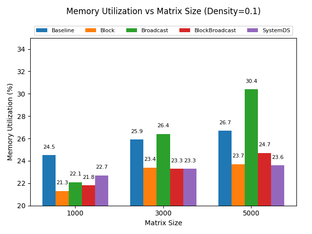
</div>

实验结果与分析：
  - 矩阵规模对内存利用率的影响（稠密度固定为 0.1）
    - Broadcast 算法内存利用率增幅最显著：从 22.1% 升至 30.4%，说明该算法在处理大规模矩阵时，内存资源开销增长较快；
    - Baseline 算法内存利用率呈中等幅度上升：从 24.5% 升至 26.7%，规模扩大对其内存占用有一定影响；
    - Block、BlockBroadcast、SystemDS内存利用率波动较小：Block 从 21.3% 微升至 23.7%，SystemDS 从 21.8% 升至 23.6%，资源占用更稳定。
  - 稠密度对内存利用率的影响（矩阵规模固定为 1000×1000）
    - Baseline、Broadcast 算法对稠密度更敏感：Baseline 从 22.5% 升至 25.9%，Broadcast 从 21.7% 升至 25.8%，稠密矩阵会显著增加其内存开销；
    - Block、BlockBroadcast、SystemDS内存利用率变化平缓：Block 仅从 21.7% 微升至 22.5%，SystemDS 从 21.7% 升至 23.0%，在不同稀疏度下资源占用更稳定。

小结：
  - 块级矩阵乘法（Block）是 Spark 中最有效的优化策略，在不同规模和稠密度条件下均能显著降低内存开销。
  - Broadcast 类方法仅适用于特定场景，不适合大规模或稠密矩阵计算。
  - SystemDS 在通用场景下表现更稳定，内置自动优化逻辑，在矩阵规模、稠密度变化的复杂任务中表现稳定，无需手动调参即可适配多种场景。

3. 对Shuffle数据量的影响
<div style="display: flex; gap: 10px; margin: 16px 0;">
  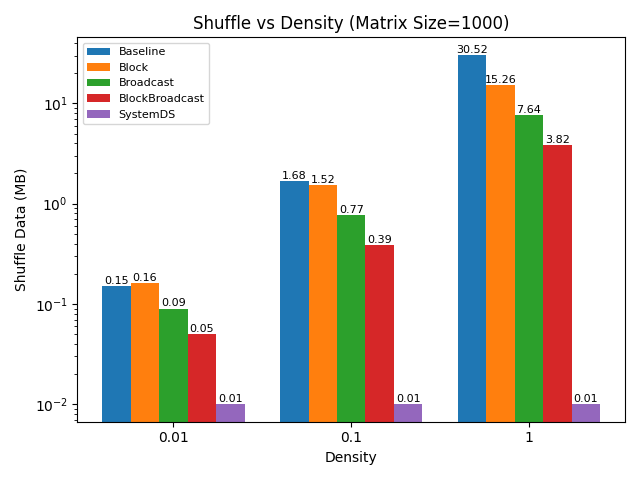
  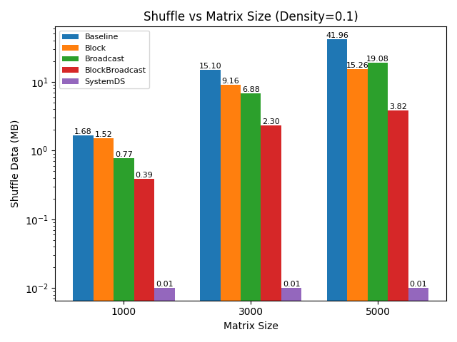
</div>

实验结果与分析：
  - 矩阵规模对 Shuffle 数据量的影响（稠密度固定为 0.1）
    - 随着矩阵规模从 1000→3000→5000 增大，Baseline、Block、Broadcast的 Shuffle 数据量大幅上升（比如 Baseline 从 1.68MB 涨到 41.96MB）；
    - BlockBroadcast的 Shuffle 数据量增长相对平缓（从 0.39MB 涨到 3.82MB）；
    - SystemDs的 Shuffle 数据量始终保持极低（稳定在 0.01MB）。

  - 矩阵密度对 Shuffle 数据量的影响（矩阵规模固定为 1000×1000）
    - 随着密度从 0.01→0.1→1 增大，Baseline、Block、Broadcast的 Shuffle 数据量显著上升（比如 Baseline 从 0.15MB 涨到 30.52MB）；
    - BlockBroadcast的 Shuffle 数据量增长幅度较小（从 0.05MB 涨到 3.82MB）；
    - SystemDs的 Shuffle 数据量同样始终维持在 0.01MB 的极低水平。

小结：
  - BlockBroadcast 是自定义实现中 Shuffle 控制最好的策略，因为其结合分块与广播机制，减少重复数据分发，大幅降低 Shuffle 数据量； 而 SystemDs 的 Shuffle 数据量几乎不受矩阵规模 / 密度影响，在 "减少数据传输" 上表现最优。

4. 对总时间的影响
<div style="display: flex; gap: 10px; margin: 16px 0;">
  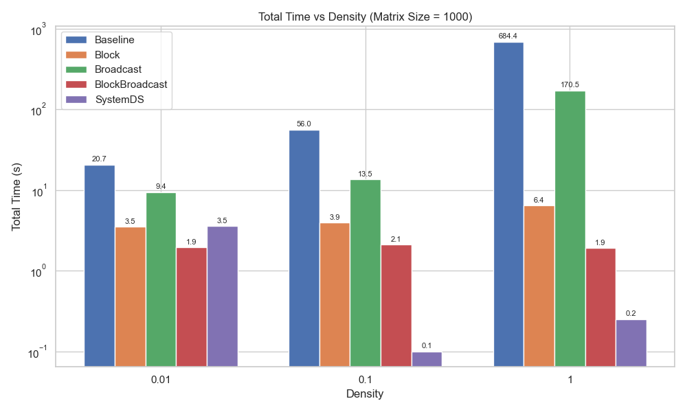
  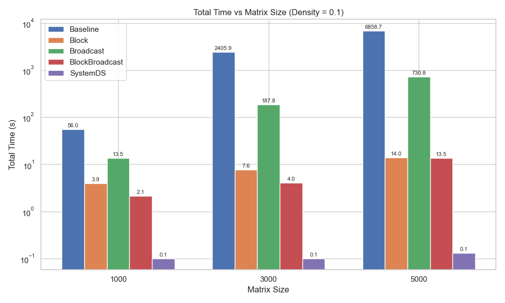
</div>

实验结果与分析：

  - 矩阵规模对总时间的影响（稠密度固定为 0.1）
    - Baseline 算法：总时间呈指数级增长，大规模场景下性能失控；
    - Block/BlockBroadcast：总时间增长平缓，是大规模计算的高效选择；
    - Broadcast：时间增长快于 Block ，大规模适应性弱；
    - SystemDS：总时间始终维持在 0.1s 左右，规模变化对其几乎无影响。

  - 稠密度对总时间的影响（矩阵规模固定为 1000×1000）
    - Baseline 算法：总时间急剧上升，不适应稠密矩阵；
    - Block/BlockBroadcast：总时间受稠密度影响小，适配高稀疏到稠密的全场景；
    - Broadcast：稠密矩阵下时间大幅上升，仅适用于高稀疏场景；
    - SystemDS：总时间始终处于低水平，稠密度变化的影响可忽略。

小结：
  - Block/BlockBroadcast 是时间性能最优的实现：在不同规模、稠密度下总时间均维持在低水平，是通用场景的首选；
  - SystemDS 的时间性能极致稳定高效，适配各类场景且无需手动调优；
  - Broadcast 仅适用于 “高稀疏 + 小规模” 场景，通用性差。
## 4 结论
### 主要发现
1.  SystemDS 综合性能最优：CPU / 内存利用率稳定、Shuffle 量极低、总时间几乎不受规模 / 密度影响；
2.  Block/BlockBroadcast 是自定义实现的最优解：Shuffle 控制好、时间增长平缓，适配多数场景；
3.  Baseline/Broadcast 局限性大：Baseline 时间 / Shuffle 随规模 / 密度暴增，Broadcast 仅适配高稀疏小规模场景。
### 原因分析
1.  SystemDS：内置底层优化（数据布局 + 调度策略），从根源减少 Shuffle 与资源浪费；
2.  Block/BlockBroadcast：分块降低数据粒度、广播减少重复传输，平衡了计算与通信；
3.  Baseline/Broadcast：Baseline 无优化导致全量 Shuffle，Broadcast 仅适合小数据广播，规模 / 密度增大后通信 / 内存开销失控。
  
## 5 分工
- 徐静蕾：master节点环境配置，block+broadcast和sysds_force实现，总执行时间分析及其图表生成
- 施曼丽：worker节点环境配置，baseline和systemds实现，内存利用率分析，ppt制作
- 祁佳馨：worker节点环境配置，block实现，cpu利用率分析，所有指标的图表生成
- 李春秋：worker节点环境配置，broadcast实现，shuffle数据量分析，视频录制及文档填写